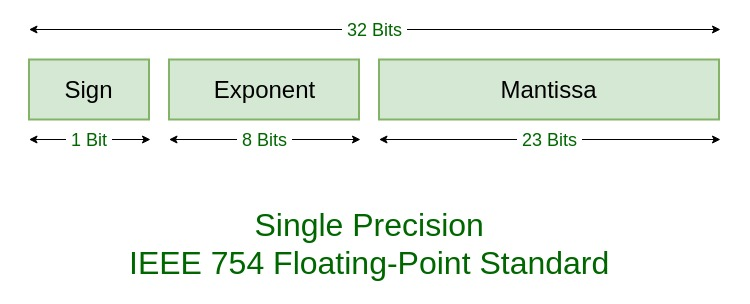

# Types of Floating Point Number Systems

## Table of Contents
- [Introduction](#Introduction)
- [IEEE 754 System](#IEEE-754-System)
- [Non-IEEE Floating Point Number Systems](#Non-IEEE-Floating-Point-Number-Systems)
- [Applications for Different Types of Floating Point Number Systems](#Applications-for-Different-Types-of-Floating-Point-Number-Systems)
- [Implementation of Floating Point Number Systems](#Implementation-of-Floating-Point-Number-Systems)
- [Hardware Implications of Floating Point Number Systems](#Hardware-Implications-of-Floating-Point-Number-Systems)
- [Sources](#Sources)

## Introduction
The term "floating-point number" refers to any number which has a decimal point in some place. For example, 12.3, -43.2, and 50.0 are instances of floating point numbers, whereas numbers such as 1, 2, and -4 are not [1]. In the realm of computing, the term floating point number is used to describe any sort of number storage method that allows the number in question to have a decimal point. By far the most popular floating-point number system is the IEEE 754 method. However, some alternatives, such as [], exist with their own sets of pros and cons.

## IEEE 754 System

### Introduction to IEEE 754
By far the most popular method of storing floating-point numbers is through the IEEE 754 system. First invented in 1985, the IEEE 754 number system uses 3 main fields: a 1-bit sign field, an exponent field, and a mantissa field. The size of the exponent and mantissa field change based on the operating system. For example, in a 32-bit operating system (referred to as single-precision), the exponent is 8 bits and the mantissa is 23 bits, as shown below:

[2]

However, in a 64-bit operating system (referred to as double-precision), the exponent is 11 bits and the mantissa is 52 bits. Note that the sign field will always only take up one bit, as one bit is sufficient to encode whether the number is positive or negative [3].

### Converting IEEE 754 to/from Decimal

Base-10 decimal numbers can be converted to IEEE 754 numbers and vice versa through the following formula:

$(-1)^{sign} * (1 + mantissa) * 2 ^ {exponent - bias}$, where $bias = 2 ^ {length \ of \ exponent} - 1$. Therefore, in a 32-bit system, bias = 127, and in a 64-bit system, bias = 1023. [4]

For example, if we had the 32-bit IEEE 754 floating point number 0xABC00000, we would have the following sign, exponent, and mantissa fields: \
sign = 1 \
exponent = 01010111 \
mantissa = 10000000000000000000000 \
bias = 127 \
Converting the exponent and mantissa to decimal yields: \
exponent = 87 \
mantissa = 0.5 (To convert the mantissa to decimal, multiply the leftmost number by $2^{-1}$, the next number by $2^{-2}$, and so on. Essentially, the mantissa can be treated as a number equal to 0.mantissa in base-2 form. In this case, that would be 0.10000000000000000000000 in base-2, which is equal to 0.5 in base-10)

This yields the expression $(-1)^{1} * (1 + 0.5) * 2 ^ {87 - 127}$ = $-1.5 * 2 ^ {-40}$ = $-1.36424 * 10 ^ {-12}$.

We can also do the opposite, converting from decimal to IEEE 754. To convert the number 3000 from decimal to 32-bit IEEE 754, first, an integer power of 2 has to be found such that $1 \geq \frac{3000}{2 ^ {exp}} < 2$. We can see that $2^{11} * 1.46484375 = 3000$. Therefore, we know our sign bit is 0 because 3000 is positive and our mantissa is 0.46484375. Our exponent will be equal to 11 + bias = 138. Therefore, we are left with these binary equivalents: \
sign = 0 \
exponent = 10001010 \
mantissa = 01110111000000000000 \
putting these numbers together yields an IEEE 754 representation of 01000101001110111000000000000, which is 45B80000 in hexadecimal notation.

### Special Number Representations

In addition to being able to model a very wide range of numbers, IEEE 754 also has a few special number representations for 0 and infinity. IEEE 754 has two forms of zero: positive and negative 0. This is because 0 is stored when the exponent and mantissa are 0. Therefore, a "positive" 0 is stored when the sign bit is 0, and a "negative" 0 is stored when the sign bit is 1. Infinity occurs when the exponent field is all ones (the largest possible exponent value) and the mantissa is 0. Similar to how zeroes are stored, a positive infinity is stored when the sign bit is 0, and a negative infinity is stored when the sign bit is 1. NaN (not a number) is stored when the exponent field is all ones and the mantissa is some nonzero value; the sign bit can be either 0 or 1 for this case [3]. 

### IEEE 754 Pros and Cons

The IEEE 754 system

## Non-IEEE Floating Point Number Systems

## Applications for Different Types of Floating Point Number Systems

## Implementation of Floating Point Number Systems

## Hardware Implications of Floating Point Number Systems

## Sources
1. https://www.freecodecamp.org/news/floating-point-definition/
2. https://www.geeksforgeeks.org/ieee-standard-754-floating-point-numbers/
3. https://docs.oracle.com/cd/E19957-01/806-3568/ncg_math.html#:~:text=IEEE%20754%20specifies%3A,and%20occupies%2064%20bits%20overall.
4. https://mathcenter.oxford.emory.edu/site/cs170/ieee754/
