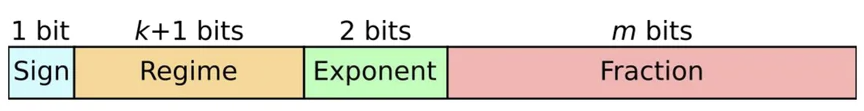
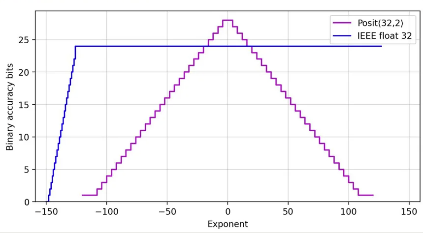
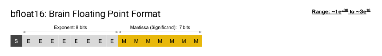
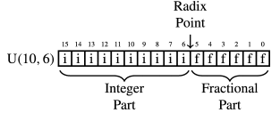

# Types of Floating Point Number Systems

## Table of Contents
- [Introduction](#Introduction)
- [IEEE 754 System](#IEEE-754-System)
- [Non-IEEE Floating Point Number Systems](#Non-IEEE-Floating-Point-Number-Systems)
- [Applications for Different Types of Floating Point Number Systems](#Applications-for-Different-Types-of-Floating-Point-Number-Systems)
- [Software and Hardware Implementation of Floating Point Number Systems](#Software-and-Hardware-Implementation-of-Floating-Point-Number-Systems)
- [Conclusion](#Conclusion)
- [Sources](#Sources)

## Introduction
The term "floating-point number" refers to any number which has a decimal point in some place. For example, 12.3, -43.2, and 50.0 are instances of floating point numbers, whereas numbers such as 1, 2, and -4 are not [1]. In the realm of computing, the term floating point number is used to describe any sort of number storage method that allows the number in question to have a decimal point. By far the most popular floating-point number system is the IEEE 754 method. However, some alternatives, such as posits, Bfloat16, minifloats, and fixed point arithmetic, exist with their own sets of pros and cons.

## IEEE 754 System

### Introduction to IEEE 754
By far the most popular method of storing floating-point numbers is through the IEEE 754 system. First invented in 1985, the IEEE 754 number system uses 3 main fields: a 1-bit sign field, an exponent field, and a mantissa field. The size of the exponent and mantissa field change based on the operating system. For example, in a 32-bit operating system (referred to as single-precision), the exponent is 8 bits and the mantissa is 23 bits, as shown below:

[2]

However, in a 64-bit operating system (referred to as double-precision), the exponent is 11 bits and the mantissa is 52 bits. Note that the sign field will always only take up one bit, as one bit is sufficient to encode whether the number is positive or negative [3].

### Converting IEEE 754 to/from Decimal

Base-10 decimal numbers can be converted to IEEE 754 numbers and vice versa through the following formula:

$(-1)^{sign} * (1 + mantissa) * 2 ^ {exponent - bias}$, where $bias = 2 ^ {length \ of \ exponent} - 1$. Therefore, in a 32-bit system, bias = 127, and in a 64-bit system, bias = 1023. [4]

For example, if we had the 32-bit IEEE 754 floating point number 0xABC00000, we would have the following sign, exponent, and mantissa fields: \
sign = 1 \
exponent = 01010111 \
mantissa = 10000000000000000000000 \
bias = 127 \
Converting the exponent and mantissa to decimal yields: \
exponent = 87 \
mantissa = 0.5 (To convert the mantissa to decimal, multiply the leftmost number by $2^{-1}$, the next number by $2^{-2}$, and so on. Essentially, the mantissa can be treated as a number equal to 0.mantissa in base-2 form. In this case, that would be 0.10000000000000000000000 in base-2, which is equal to 0.5 in base-10)

This yields the expression $(-1)^{1} * (1 + 0.5) * 2 ^ {87 - 127}$ = $-1.5 * 2 ^ {-40}$ = $-1.36424 * 10 ^ {-12}$.

We can also do the opposite, converting from decimal to IEEE 754. To convert the number 3000 from decimal to 32-bit IEEE 754, first, an integer power of 2 has to be found such that $1 \geq \frac{3000}{2 ^ {exp}} < 2$. We can see that $2^{11} * 1.46484375 = 3000$. Therefore, we know our sign bit is 0 because 3000 is positive and our mantissa is 0.46484375. Our exponent will be equal to 11 + bias = 138. We are now left with these binary equivalents: \
sign = 0 \
exponent = 10001010 \
mantissa = 01110111000000000000 \
putting these numbers together yields an IEEE 754 representation of 01000101001110111000000000000, which is 45B80000 in hexadecimal notation.

### Special Number Representations

In addition to being able to model a very wide range of numbers, IEEE 754 also has a few special number representations for 0 and infinity. IEEE 754 has two forms of zero: positive and negative 0. This is because 0 is stored when the exponent and mantissa are 0. Therefore, a "positive" 0 is stored when the sign bit is 0, and a "negative" 0 is stored when the sign bit is 1. Infinity occurs when the exponent field is all ones (the largest possible exponent value) and the mantissa is 0. Similar to how zeroes are stored, a positive infinity is stored when the sign bit is 0, and a negative infinity is stored when the sign bit is 1. NaN (not a number) is stored when the exponent field is all ones and the mantissa is some nonzero value; the sign bit can be either 0 or 1 for this case [3]. 

### IEEE 754 Pros and Cons

The most obvious upside of the IEEE 754 number system is the fact that it is so widely adopted. As a result, when creating low-level programs that need to be used on various types of computers, using the IEEE 754 system would be a very safe bet when compared to the other number systems discussed below. Another advantage of IEEE 754 is that it can display a very wide range of numbers. For example, not counting positive or negative infinity or zero, a 32-bit IEEE system can store numbers from 1.1754E-38 to 3.4028E+38, and the same range of negative numbers.

On the other hand, IEEE 754 also comes with its own set of downsides. The most prevalent downside of IEEE 754 is floating point error. When doing arithmetic operations on numbers that are several magnitudes away from each other (example: $10^{40} + 10^{-30}$), because of the way numbers are stored in IEEE 754, some digits will be cut off. This will lead to a loss of accuracy, especially if these errors are allowed to propagate through a certain problem and become larger [5]. Another downside of IEEE 754 is that it has a fixed number of bits for the mantissa and exponent. This could lead to unnecessary space being allocated to either field, which may potentially result in a loss of information because there are not enough bits to store the information [6].

## Non-IEEE Floating Point Number Systems

### Posits

Posits are arguably the most frequently cited alternative to IEEE 754 numbers. While the IEEE 754 system consists of 3 main parts: a sign bit, exponent, and mantissa, the posit instead has 4 parts: the sign bit, regime, exponent, and mantissa, as shown in the figure below: 

[7] \
\* Note that this figure calls the mantissa portion of the number a fraction - both terms are interchangeable in this context. Also, as will be discussed shortly, the size of the exponent field is variable and does not necessarily have to be 2. 

The regime bits can vary in length based on the size of the number. The length of the regime is determined by the length of consecutive zeros or 1s. For example, if directly after the sign bit we had 0001, the regime is considered to be 000. Conversely, if we had 1111110 in the regime space, the regime is considered to be 111111. In the example above, there are two exponent bits. However, this can change based on the implementation used. The number $es$ represents the maximum number of exponent bits possible (in the example above, $es = 2$). If there are at least $es$ bits left after the regime, then $es$ bits will be saved for the regime, and any leftover bits will be the mantissa portion of the number. If there are $es$ or fewer bits left, then all of the remaining bits will be dedicated to the exponent, and no bits will be allocated for the mantissa. 

To convert between posit numbers to base-10 (and vice versa), the following formula is used:

$$num = (-1)^b * (1 + mantissa) * 2^{e + k * 2^{es}}$$[8]

Where b is the sign bit, mantissa is the value inside the mantissa (calculated the same way as in IEEE 754 format), and e is the value in the exponent field. k is defined as the length of the regime space. If there are $l$ 1s in the regime space, k = $l - 1$. If there are instead $l$ 0s in the regime space, then k = $-l$. Lastly, es is defined as the maximum number of exponent bits possible. 

There are two special numbers in the posit format: 0 and +/- infinity. When the whole posit number is 0s, then zero is stored. When a 1 is followed by all 0s, then the number is stored as +/- infinity. There is no way to store a strictly positive or strictly negative infinity in the posit format. [9]

The main upside to posit numbers is that they are more accurate for numbers with exponents close to 0. This is because more bits can be dedicated to the fraction portion of the number since we will likely have a regime value close to 0. Posits also have a much greater range than a similar size IEEE number thanks to the inclusion of the regime field.

[7]

The main drawback to posit numbers is shown in the graph above; while Posits are slightly more accurate with numbers that have an exponent near 0, they are much more inaccurate for very large or very small numbers. This is because fewer bits are dedicated to the fraction in posit numbers when compared to IEEE numbers if several regime bits are needed, leading to a loss in information.

### Bfloat16

Bfloat16 is a number format designed specifically for machine learning applications. As the name suggests, it is a 16-bit number format that has 1 sign bit, 7 exponent bits, and 8 mantissa bits. 

[10]

Calculations to convert bfloat16 to decimal and vice versa are done in the exact same manner as IEEE 754 numbers: $(-1)^{sign} * (1 + mantissa) * 2 ^ {exponent - bias}$. However, in this case, because the size of the exponent field in bfloat16 numbers is fixed, the bias term will always be equal to 127. Therefore, we can simply the formula to $(-1)^{sign} * (1 + mantissa) * 2 ^ {exponent - 127}$. 

The main upside to bfloat16 is hardware efficiency. Because bfloat16 numbers only have 16 bits, hardware computations can be done much faster than with 32 or 64-bit numbers. One such application is the realm of machine learning, where massive amounts of computations have to be completed to output a result. 

The most prevalent downside of bfloat16 also comes as a result of its size. Because bfloat16 is only 16 bits, it cannot store nearly as much information as a 32-bit IEEE or posit number can. In other words, the tradeoff for faster computations with bfloat16 numbers is a lower accuracy.

### Minifloats

Minifloats are a more general type of bfloat16 numbers. The term minifloat refers to any floating-point number represented with very few bits. The format of these numbers is described using a list of 4 values: (S, E, M, B). S is the length of the sign field, which is almost always either 0 or 1. E is the length of the exponent field, M is the length of the mantissa, and B is the value of the bias term in converting the numbers from binary to decimal [11]. For example, if a minifloat had the format (1, 5, 6, 31), the binary number would be 1 + 5 + 6 = 12 bits long, and to convert these binary numbers to decimal and vice versa, the formula would be $(-1)^{sign} * (1 + mantissa) * 2 ^ {exponent - 31}$. 

Minifloats have very similar pros and cons to bfloat16 numbers; their smaller size allows for faster computations, but this smaller size comes at the cost of accuracy.

### Fixed-Point Numbers

Fixed-point numbers are a type of floating point number which has a fixed number of bits dedicated to the left of the decimal point, and a fixed number of bits dedicated to the right of the decimal point. The format of these numbers is denoted as U(x, y), where x is the number of bits to the left of the decimal place (the integer portion of the number), and y is the number of bits to the right of the decimal place (the fractional portion of the number). For example, a U(10, 6) number would look like:

[13]

If the number includes a sign bit, the fixed-point number is instead denoted as S(x, y), where there is 1 sign bit at the start of the number, then x integer bits and y fractional bits. 

The primary upside of fixed-point numbers is their efficiency. Because fixed-point numbers do not have an exponent field and only sometimes have a sign field, computations with these numbers are nearly as fast as with integers, making fixed-point numbers the most efficient floating-point number storage method when compared with IEEE 754, posits, bfloat16, or minifloats. On the other hand, their main downside is the lack of range. Because there is no exponent field, fixed-point numbers have by far the smallest range of their equally-sized floating-point counterparts [14].

## Applications for Different Types of Floating Point Number Systems

### IEEE 754

IEEE 754 is treated as the "gold standard" for floating-point number storage. As a result, when creating programs that have to work across multiple different architectures, using IEEE 754 is typically the best choice. All Intel x86 processors [15] in addition to all AMD processors [16] are compliant with the IEEE 754 standard. IEEE 754 also provides the best compromise between the range of values it can hold and the accuracy of the values it holds. Therefore, in cases where the value being stored could range by several magnitudes, using IEEE 754 would make the most sense to minimize overall information loss.

### Posits

Posit numbers shine when they have an exponent close to 0, as shown in the graph depicting the accuracy of posit numbers compared to the accuracy of IEEE 754 numbers. As a result, one application of posits is their accuracy when dealing with numbers that have a low-magnitude exponent. In addition, because posits have a larger range than IEEE 754 numbers thanks to the inclusion of a regime field, posit numbers are useful when dealing with very large numbers while not having many bits to store the data.

### Bfloat16 and Minifloats

Bfloat16 and minifloats have very similar applications thanks to their almost identical formats. The most common application for these numbers (and the motivation for the creation of the bfloat16 data type) is in machine learning. In this field, using IEEE-754-style numbers in 16-bit format provides the best common ground between numerical accuracy and hardware efficiency [10]. To be more specific, in computer vision, minifloats are used to approximate the numerical values used in convolutional neural networks (CNNs) [12].

### Fixed-Point Numbers

Fixed-point numbers were once used in gaming consoles before they were fitted with the capabilities to handle floating-point computations. The last generation of gaming consoles to use fixed-point numbers were the fifth-generation consoles such as the Nintendo 64. These numbers are also used in machines where integer computations are significantly faster than floating-point computations [18]. Another application of fixed-point numbers is in signal processing, where quick recognition of these numbers and the values they hold is important [17].

## Software and Hardware Implementation of Floating Point Number Systems

### IEEE 754/bfloat16/minifloats

Because bfloat16 and minifloats still use the IEEE 754 format, all three number types carry the same upsides and downsides when examining these numbers from a hardware and software perspective.

In software, IEEE 754 is implemented through the use of floating-point libraries. In other words, while the human user may be able to write down numbers in base-10 in their code/workspace, the computer will implicitly convert these numbers to IEEE 754 when storing them in memory. The process by which a computer does this is similar to the one described above: first, the sign bit is evaluated. The exponent is then calculated, and the mantissa is calculated last. The mantissa is then rounded based on whatever rounding scheme the architecture supports (round to the nearest number, round up, or round down) [19]. 

From a hardware perspective, IEEE 754 format numbers are in a sort of middle ground; while they are not as fast as fixed-point numbers, they are between 30 and 60% faster than posit numbers. 

### Posits

Although posits have a different format from IEEE 754 numbers, their implementation in software is very similar. Several different libraries exist on the internet that can be downloaded to make a computer compatible with posit numbers. One such publically available implementation is at this GitHub repository: https://github.com/cjdelisle/libposit [20]. The way that this specific library works is by defining the structure of a posit number as well as the operations for simple binary instructions such as add, subtract, bitwise or, and bitwise and. 

From a hardware perspective, posit numbers can be quite tricky to implement. This is because a posit number has four fields, while the IEEE format has 3 fields, and the fixed-point number format has either 1 or 2 fields. As a result of having more fields, more conversions have to be completed before the numbers can be added. This leads to posit numbers having the highest hardware complexity of the different number types discussed [22].

### Fixed-Point Numbers

Fixed-point numbers arguably have the simplest implementation of the number types discussed in this article. Because they do not have any special fields such as exponents and mantissas; instead, they only have the number being stored in binary format and sometimes a sign bit. Therefore, from a software point of view, fixed-point numbers are the simplest to deal with. 

Similarly, from a hardware perspective, fixed-point numbers are the simplest to understand. Because fixed-point numbers are stored in the same way as integers, addition and subtraction of these numbers is very simple. Fixed-point numbers are added in the same way integers are, with a shift if necessary to "line up" the decimal points of both numbers. For example, if a computer wanted to add 1001.01 + 100.1 (for this example, no sign bit is used), the computer would first convert 100.1 to 100.10, then add the corresponding place values from right to left. Therefore, the computer would then store 1101.11 [21].

## Conclusion

## Sources
1. https://www.freecodecamp.org/news/floating-point-definition/
2. https://www.geeksforgeeks.org/ieee-standard-754-floating-point-numbers/
3. https://docs.oracle.com/cd/E19957-01/806-3568/ncg_math.html#:~:text=IEEE%20754%20specifies%3A,and%20occupies%2064%20bits%20overall.
4. https://mathcenter.oxford.emory.edu/site/cs170/ieee754/
5. https://learn.microsoft.com/en-us/office/troubleshoot/excel/floating-point-arithmetic-inaccurate-result
6. https://babbage.cs.qc.cuny.edu/IEEE-754.old/References.xhtml
7. https://spectrum.ieee.org/floating-point-numbers-posits-processor
8. https://www.johndcook.com/blog/2018/04/11/anatomy-of-a-posit-number/#:~:text=A%20posit%20number%20type%20is,devoted%20to%20the%20exponent%2C%20es
9. https://www.sigarch.org/posit-a-potential-replacement-for-ieee-754/
10. https://cloud.google.com/tpu/docs/bfloat16
11. https://mrob.com/pub/math/floatformats.html
12. https://www.mdpi.com/2076-3417/11/23/11164
13. https://www.sciencedirect.com/topics/computer-science/fixed-point-number#:~:text=1%20Fixed%2DPoint%20Number%20Systems,bits%20and%20four%20fraction%20bits
14. https://inst.eecs.berkeley.edu/~cs61c/sp06/handout/fixedpt.html#:~:text=In%20other%20word%2C%20fixed%20point,to%20a%20quantum%20of%200.5.
15. http://www.mscs.mu.edu/~georgec/IFAQ/casares1.html#:~:text=IEEE%20754%3A%20Intel%20x86%2C%20and,other%20Cray%20models%20have%20been
16. https://community.amd.com/t5/opencl/amd-gpus-ieee-754-compliance/td-p/98382?attachment-id=6602
17. https://www.geeksforgeeks.org/fixed-point-representation/#:~:text=In%20digital%20signal%20processing%20(DSP,using%20the%20binary%20point%20concept.
18. http://rsync.irixnet.org/tutorials/pstutorials/chapter1/5-fixedpoint.html#:~:text=Fixed%20point%20math%20is%20used,IBM%20compatible%20PCs).
19. https://medium.com/@thishankahadugoda/how-computer-deal-with-floating-point-numbers-decimal-to-ieee-754-floating-point-representation-20d845436c9f
20. https://github.com/cjdelisle/libposit
21. https://www.allaboutcircuits.com/technical-articles/fixed-point-representation-the-q-format-and-addition-examples/
22. https://ieeexplore.ieee.org/document/8892116
23. https://hal.science/hal-03195756v3/file/2021_Posit_IEEE754_Hardware_Cost.pdf
